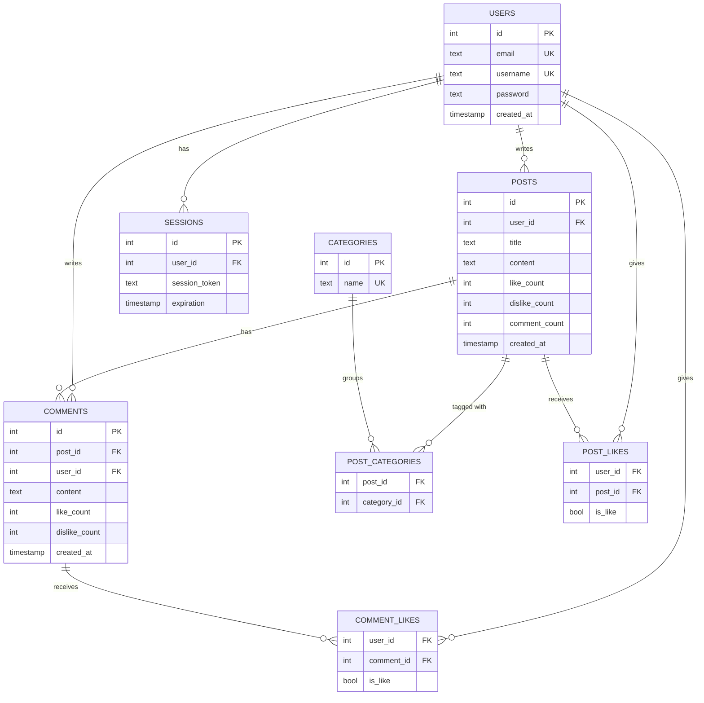

# Forum — EduTalks

A web forum built with **Go** and **SQLite**, with no frontend framework. Users can register, create posts in categories, comment, like or dislike posts and comments, and filter the feed. The app runs in a **Docker** container.

Built as a team project at **Zone01 Oujda**.

---

## Features

**Authentication**
- Register with email, username, and password. Duplicate emails or usernames are rejected.
- Log in with either email or username.
- Passwords are hashed with **bcrypt**.
- Sessions use a **UUID**-based token stored in an `HttpOnly` cookie that expires after 1 hour.
- One active session per user: logging in on a new device ends the old session.
- Expired sessions are cleaned from the database every hour.

**Posts and comments**
- Only registered users can create posts and comments. Everyone can read them.
- Each post has one or more categories: General, Entertainment, Health, Business, Sports, Technology.
- Posts, comments, and reactions are sent with `fetch`, so the page doesn't reload.
- Infinite scroll loads 10 posts at a time.

**Likes and dislikes**
- Registered users can like or dislike posts and comments. Clicking the same reaction again removes it.
- Like and dislike counts are visible to everyone.

**Filters**
- **Categories**, which work like subforums
- **My posts**: posts created by the logged-in user
- **Liked posts**: posts liked by the logged-in user
- **Trending**: the most liked posts

**Safety and errors**
- Input validation on the server: email format, username of 3–19 characters, and passwords of 8–64 characters with a lowercase letter, an uppercase letter, a digit, and a symbol.
- Rate limits: 5 posts per 5 minutes and 10 comments per minute. Going over returns `429 Too Many Requests`.
- A database trigger blocks duplicate posts (same title and content).
- A custom error page returns the right HTTP status: `400`, `401`, `404`, `405`, `429`, `500`.

---

## Tech stack

| Layer | Technology |
|---|---|
| Backend | Go 1.22 (standard library `net/http`, `html/template`) |
| Database | SQLite (`mattn/go-sqlite3`) |
| Security | `golang.org/x/crypto/bcrypt`, `google/uuid` |
| Frontend | HTML, CSS, vanilla JavaScript |
| Deployment | Docker (multi-stage build) |

---

## Getting started

### Run with Go

Requirements: Go 1.22+ and a C compiler (needed by `go-sqlite3`).

```bash
git clone https://github.com/twlmed212/Forum.git
cd Forum
go run . forum.db
```

Open **http://localhost:9090**.

The argument is the database file. It is created automatically with all tables, triggers, and default categories.

### Run with Docker

```bash
docker build -t forum .
docker run -p 9090:9090 forum
```

Open **http://localhost:9090**.

---

## Database

The schema has 8 tables. Counters (likes, dislikes, comments) are stored on posts and comments and updated with SQLite triggers.



---

## Routes

| Method | Route | Description | Login required |
|---|---|---|---|
| GET | `/` | Home page | No |
| GET | `/infinite-scroll?type=…&offset=…` | Posts as JSON. `type` is `home`, `trending`, `category`, `liked`, or `profile` | No (`liked` needs login) |
| GET | `/post/{id}` | One post with its comments | No |
| GET | `/login`, `/register` | Login and register page | No |
| POST | `/login` | Log in with email or username | No |
| POST | `/register` | Create an account | No |
| GET | `/logout` | End the session | Yes |
| POST | `/createPost` | Create a post (JSON) | Yes |
| POST | `/CreateComment` | Add a comment (JSON) | Yes |
| POST | `/PostReaction` | Like or dislike a post or comment (JSON) | Yes |

---

## Project structure

```
Forum/
├── main.go                 # Server setup and routes
├── Dockerfile              # Multi-stage build
├── database/               # SQLite setup, tables, triggers, queries
│   └── querries/           # SQL query strings
├── handlers/               # HTTP handlers (auth, posts, comments, reactions, errors)
│   └── token/              # Session token generation
├── structs/                # Shared data types
└── frontend/
    ├── templates/          # HTML templates and components
    └── assets/             # CSS, JavaScript, images
```

---

## What we learned

- How HTTP, cookies, and sessions work without a framework
- Designing a relational schema and writing SQL by hand: joins, triggers, constraints
- Password hashing and basic web security
- Containerizing a Go application with Docker
- Working as a team with Git: branches, merges, and code review

---

## Team

- **Mohamed Tawil**: [@twlmed212](https://github.com/twlmed212)
- **Mohammed Elalj**: [@Med-Elalj](https://github.com/Med-Elalj)
- **Omar El Haouch**
- **Ismail Bentour**
